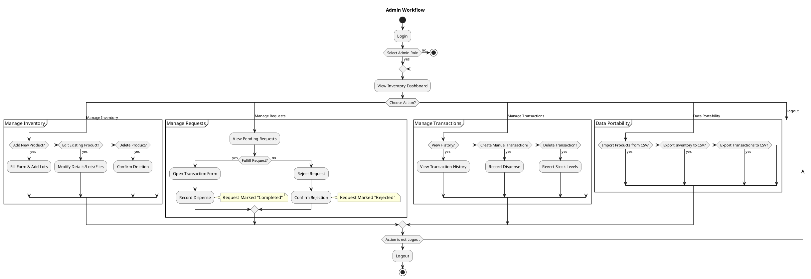
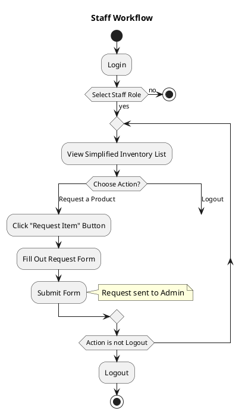

# StockPilot Process Diagram

This document outlines the primary user workflows for the StockPilot inventory management system, separated by user role, using PlantUML syntax.

## Admin Workflow

## Staff Workflow

